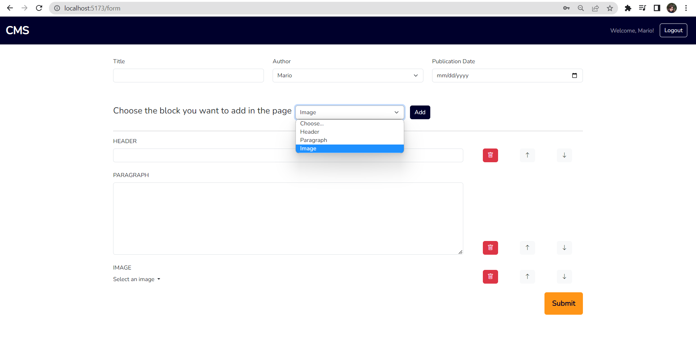

[](https://classroom.github.com/a/8AapHqUJ)

# Exam #1: "cmsmall"
## Student: s315908 Yarahmadi Pegah 

## React Client Application Routes

- Route `/`: landing page showing list of all published pages (authorized and non authorized)
- Route `/form`: The form page for adding new page
- Route `/form/:id`: The edit form containing the data of an existing page to be updated/edited
- Route `/page/details/:id`: Detail page: showing the content of a page in a separate page by clicking on "more" button
- Route `/login`: login page for authentication

---------------------------------------------------------------------------------------------

## API Server

### User management

#### Login

* HTTP method: `POST`  URL: `/api/sessions`
* Description: authenticate the user who is trying to login
* Request body: credentials of the user who is trying to login

``` JSON
{
    "username": "username",
    "password": "password"
}
```

* Response: `200 OK` (success)
* Response body: authenticated user

``` JSON
{
    "id": 1,
    "username": "john.doe@polito.it", 
    "name": "John"
}
```

* Error responses:  `500 Internal Server Error` (generic error), `401 Unauthorized User` (login failed)

------------------------------------------------------------------------------------

#### Check if user is logged in

* HTTP method: `GET`  URL: `/api/sessions/current`
* Description: check if current user is logged in and get her data
* Request body: _None_
* Response: `200 OK` (success)

* Response body: authenticated user

``` JSON
{
    "id": 1,
    "username": "john.doe@polito.it", 
    "name": "John"
}
```

* Error responses: `500 Internal Server Error` (generic error), `401 Unauthorized User` (user is not logged in)

------------------------------------------------------------------------------------

#### Logout

* HTTP method: `DELETE`  URL: `/api/sessions/current`
* Description: logout current user
* Request body: _None_
* Response: `200 OK` (success)

* Response body: _None_

* Error responses: `500 Internal Server Error` (generic error), `401 Unauthorized User` (user is not logged in)

------------------------------------------------------------------------------------

#### Get all pages

* HTTP method: `GET`  URL: `/api/pages`
* Description: Get the full list of pages
* Request body: _None_
* Request query parameter: _filter_ name of the filter to apply (filter-all, filter-published)
* Response: `200 OK` (success)
* Response body: Array of objects, each describing one page:

``` json
[
 {
    "id": 1,
    "user": 1,
    "title": "Season 2",
    "author": "John",
    "Creation_date": "2023-06-24",
    "publication_date": "2023-06-25",
    "blocks": [
      {"type":"HEADER","value":"This is the first header"},
      {"type":"IMAGE","value":{"title":"Image3","src":"/src/images/3.jpg"}},
      {"type":"PARAGRAPH","value":"Contrary to popular belief, Lorem Ipsum is not simply random text. It has roots in a piece of classical Latin literature from 45 BC, making it over 2000 years old. Richard McClintock, a Latin professor at Hampden-Sydney College in Virginia, looked up one of the more obscure Latin words, consectetur, from a Lorem Ipsum passage, and going through the cites of the word in classical literature, discovered the undoubtable source. Lorem Ipsum comes from sections 1.10.32 and 1.10.33 of \"de Finibus Bonorum et Malorum\" (The Extremes of Good and Evil) by Cicero, written in 45 BC. This book is a treatise on the theory of ethics, very popular during the Renaissance. The first line of Lorem Ipsum, \"Lorem ipsum dolor sit amet..\", comes from a line in section 1.10.32.\n\nThe standard chunk of Lorem Ipsum used since the 1500s is reproduced below for those interested. Sections 1.10.32 and 1.10.33 from \"de Finibus Bonorum et Malorum\" by Cicero are also reproduced in their exact original form, accompanied by English versions from the 1914 translation by H. Rackham."},
      {"type":"IMAGE","value":{"title":"Image4","src":"/src/images/4.jpg"}}
          ]
  },
  {
    "id": 4,
    "user": 2,
    "title": "Sahar",
    "author": "Mario",
    "Creation_date": "2023-06-25",
    "publication_date": "2023-06-26",
    "blocks": [
      {"type":"HEADER","value":"asd"},
      {"type":"PARAGRAPH","value":"dfdfg"}
      ]
  },
  ...
]
```

* Error responses:  `500 Internal Server Error` (generic error)

------------------------------------------------------------------------------------------------------

#### Get a page by its id

* HTTP method: `GET`  URL: `/api/pages/:id`
* Description: Get the page corresponding to the id
* Request body: _None_
* Response: `200 OK` (success)
* Response body: One object describing the required page:

``` JSON
[
  {
    "id": 1,
    "user": 1,
    "title": "Season 2",
    "author": "John",
    "Creation_date": "2023-06-24",
    "publication_date": "2023-06-25",
    "blocks": [
      {"type":"HEADER","value":"This is the first header"},
      {"type":"IMAGE","value":{"title":"Image3","src":"/src/images/3.jpg"}},
      {"type":"PARAGRAPH","value":"Contrary to popular belief, Lorem Ipsum is not simply random text. It has roots in a piece of classical Latin literature from 45 BC, making it over 2000 years old. Richard McClintock, a Latin professor at Hampden-Sydney College in Virginia, looked up one of the more obscure Latin words, consectetur, from a Lorem Ipsum passage, and going through the cites of the word in classical literature, discovered the undoubtable source. Lorem Ipsum comes from sections 1.10.32 and 1.10.33 of \"de Finibus Bonorum et Malorum\" (The Extremes of Good and Evil) by Cicero, written in 45 BC. This book is a treatise on the theory of ethics, very popular during the Renaissance. The first line of Lorem Ipsum, \"Lorem ipsum dolor sit amet..\", comes from a line in section 1.10.32.\n\nThe standard chunk of Lorem Ipsum used since the 1500s is reproduced below for those interested. Sections 1.10.32 and 1.10.33 from \"de Finibus Bonorum et Malorum\" by Cicero are also reproduced in their exact original form, accompanied by English versions from the 1914 translation by H. Rackham."},
      {"type":"IMAGE","value":{"title":"Image4","src":"/src/images/4.jpg"}}
          ]
  }
]
```

* Error responses:  `500 Internal Server Error` (generic error), `404 Not Found` (not present or unavailable)

---------------------------------------------------------------------------------------------------

#### Update an existing page

* HTTP method: `PUT`  URL: `/api/pages/:id`
* Description: Update values of an existing page, except the id (user property, if present, is ignored and substituted with the value 1)
* Request body: description of the object to update

``` JSON
[
  {
    "id": 1,
    "user": 1,
    "title": "Season 2 next episode",
    "author": "John",
    "Creation_date": "2023-06-24",
    "publication_date": "2023-06-25",
    "blocks": [
      {"type":"HEADER","value":"This is the first header"},
      {"type":"IMAGE","value":{"title":"Image3","src":"/src/images/3.jpg"}},
      {"type":"PARAGRAPH","value":"Contrary to popular belief, Lorem Ipsum is not simply random text. It has roots in a piece of classical Latin literature from 45 BC, making it over 2000 years old. Richard McClintock, a Latin professor at Hampden-Sydney College in Virginia, looked up one of the more obscure Latin words, consectetur, from a Lorem Ipsum passage, and going through the cites of the word in classical literature, discovered the undoubtable source. Lorem Ipsum comes from sections 1.10.32 and 1.10.33 of \"de Finibus Bonorum et Malorum\" (The Extremes of Good and Evil) by Cicero, written in 45 BC. This book is a treatise on the theory of ethics, very popular during the Renaissance. The first line of Lorem Ipsum, \"Lorem ipsum dolor sit amet..\", comes from a line in section 1.10.32.\n\nThe standard chunk of Lorem Ipsum used since the 1500s is reproduced below for those interested. Sections 1.10.32 and 1.10.33 from \"de Finibus Bonorum et Malorum\" by Cicero are also reproduced in their exact original form, accompanied by English versions from the 1914 translation by H. Rackham."},
      {"type":"IMAGE","value":{"title":"Image4","src":"/src/images/4.jpg"}}
          ]
  }
]
```

* Response: `200 OK` (success)
* Response body: the object as represented in the database

* Error responses: `503 Service Unavailable` (database error)

-----------------------------------------------------------------------------------------------------

#### Add a new page

* HTTP method: `POST`  URL: `/api/pages`
* Description: Add a new page to the pages of user 1
* Request body: description of the object to add (user property, if present, is ignored and substituted with the value 1, page id value is not required and is ignored)

``` JSON
[
  {
    "id": 2,
    "user": 2,
    "title": "The new journey",
    "author": "Mario",
    "Creation_date": "2023-06-24",
    "publication_date": "2023-06-25",
    "blocks": [
      {"type":"HEADER","value":"my header rtt"},
      {"type":"PARAGRAPH","value":"my\nlong\nparagraph"},
      {"type":"IMAGE","value":{"title":"Image2","src":"/src/images/2.jpg"}}]
  }
]
```

* Response: `200 OK` (success)
* Response body: the object as represented in the database

* Error responses: `503 Service Unavailable` (database error)

-----------------------------------------------------------------------------------------------------------


#### Delete an existing page

* HTTP method: `DELETE`  URL: `/api/pages/:id`
* Description: Delete an existing page
* Request body: _None_

* Response: `200 OK` (success)
* Response body: an empty object

* Error responses:  `503 Service Unavailable` (database error)

-----------------------------------------------------------------------------------------------------------


## Database Tables

- Table `users` - contains id email name hash salt type
- Table `pages` - contains id user title author creation-date publication-date blocks


## Main React Components

- `AllPages` (in `AllPages.jsx`): Managing all of the pages
- `Auth` (in `Auth.jsx`): Managing login and logout operations
- `DetailPage` (in `DetailPage.jsx`): for showing the content of each page in a separate page
- `RouteFilters` (in `Filters.jsx`): the list of filters labels to show, the filter that is currenctly selected 
- `Navigation` (in `Navigation.jsx`): Managing navbar that contains website name and login + logout buttons/links
- `PageTable` , `PageRow` (in `PageLibrary.jsx`): Containing the structure for all pages as box design
- `PageManagement` (in `PageManagement.jsx`): Responsible form for adding and editing pages-containing properties
of A title, An author, A creation date, A publication date, Some blocks of content(that is header/paragraph/image).
with possibility of adding inifint blocks and reordering each block
- `getPublicationStatus` (in `getPublicationStatus.js`): Managing the status of the pages based the Publication Date 
...


## Screenshot

<!-- The below Screenshot is the landing page as non-admin user-showing the authored page with action buttons
not authored pages/other pages without actions buttons -->


-------------------------------------------------------------------------------------------------------------

<!-- The below Screenshot is the form page as non-admin user-showing the form for add/edit pages containig the inputes for Title,
 Author, Publication Date, the blocks of header/paragraph/image as a selection for user to add-->



## Users Credentials

- username, password (plus any other requested info)
- username, password (plus any other requested info)

Here you can find a list of the users already registered inside the provided database.

|         email         |   name   | plain-text password |     type         |
|-----------------------|----------|---------------------|------------------|
| john.doe@polito.it    | John     | password            |    admin         |
| mario.rossi@polito.it | Mario    | password            |    user          |
| pegahymd@gmail.com    | Pegah    | password            |    admin         |
| testuser@polito.it    | Testuser | password            |    user          |

